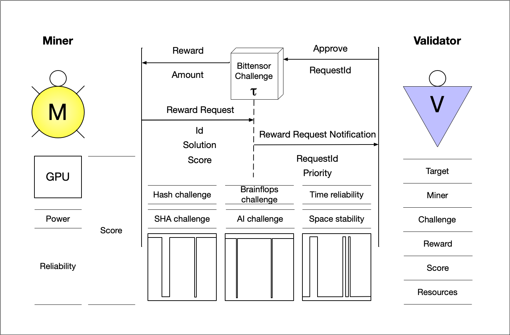
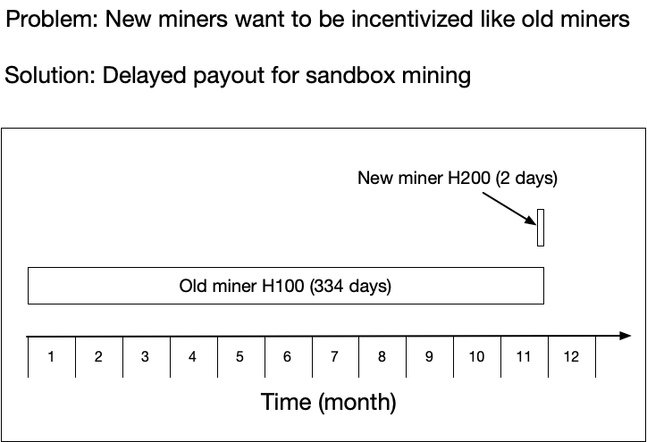
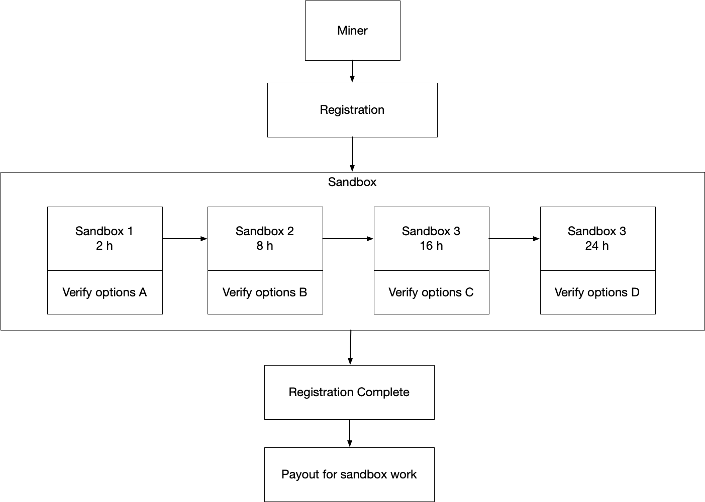

# Brief

Bittensor's Compute Subnet offers comprehensive [benchmarking](#benchmarking), [mining](#mining), and [validation](#validation) services for supported hardware of each axon of Bittensor Network. This ensures optimal performance and compatibility with the hardware specifications and [scoring](#scoring). Through sophisticated [algorithms](#algorithms) the network optimizes resource utilization, verification and maximizes efficiency. Additionally, it provides real-time monitoring and analytics to track performance metrics and identify potential bottlenecks. Overall, the compute-network provide complex axon verification with [validation bot](validation-bot-crawler). 

Based on [benchmarking](#benchmarking) and [validation](#validation) results, miners are [rewarded](#rewards), providing [incentivization](#incentivization-transformer) that contributes to the expansion and strengthening of the Bittensor Network.

### Table of Contents

- [Overview](#overview)
- [High Level Architecture](#high-level-architecture)
- [Mining](#mining)
- [Scoring and Incentivization Mechanism](#scoring-and-incentivization-mechanism)
  - [Scoring](#scoring)
    - [Scoring Transformer](#scoring-transformer)
  - [Rewards](#rewards)
    - [Incentivization Transformer](#incentivization-transformer)
- [Validation](#validation)
- [Validation Bot Crawler](#validation-bot-crawler)
- [Benchmarking](#benchmarking)
  - [Axon Benchmarking Overview](#axon-benchmarking-overview)
  - [Benchmarking Features](#benchmarking-features)
  - [Benchmarking Algorithms](#benchmarking-algorithms)
- [Tests](#tests)
  - [Test Results](#test-results)
- [Miner Registration](#miner-registration)

## Overview

## High Level Architecture

# Mining

# Scoring and Incentivization Mechanism

- GPU
  - computational power
  - reliability

## Scoring

### Scoring Transformer

## Rewards

### Incentivization Transformer

# Validation

The validator worker extracts data from the `gpu_benchmark_results` table for the given axon and applies a transformer to determine the [score](#scoring);

# Validation Bot Crawler

The validation bot conducts security and correctness checks on axons. It crawls the network from a specified range of axons and performs a check on a random node by giving it a random task and verifying the result. The network load created by the bot should not exceed 0.01% of Bittenser Network. Details of the bot's operation are outlined in the [Validation Bot Crawler Proposal](validation_bot_crawler_proposal.md)

# Benchmarking

A set of algorithms is used for benchmarking to determine the performance and stability metrics of the hardware installed in the axon.

## Axon Benchmarking Overview

The performance and quality of models are increasing every day and the latest developments allow a models to be used even on commercial CPUs. While the main priority is GPU, we will consider all cases including CPU, for better understanding. To determine the algorithm, hardware specifications, GPU, CPU, internet connection and services supported by the Axons are taken into account (see Table 1: gpu_benchmark_configuration). CPU and GPU benchmarking utilize a variety of algorithms, ranging from simple ones like hashcat and x11 to complex interactions such as prompting solver and model training to determine the best performance metrics for running tasks.

**Table 1: gpu_benchmark_configuration**

When metrics are obtained, the data is stored in the Table 2: gpu_benchmark_results

**Table 2: gpu_benchmark_results**

## Benchmarking Features

- **Benchmark CPU**
- **Benchmark GPU**
- **Benchmark Space**
- **Benchmark Reliability**

## Benchmarking Algorithms

- CPU benchmark

- GPU benchmark
  - hashcat (various algorithms, MD5, SHA256)
  - tinygrad (training, prompting)
  - gputest (CUDA PyTorch)
  - gpu_burn (CUDA PyTorch)
  - cudominer (RandomX, KAWPOW, Etchash)
  - bfgminer (SHA-256d, X11, Scrypt)
  - Cgminer or Xmrig (CryptoNight, various)
  - zcash (Equihash, memory profiling)

### Hashcat benchmark

The Hashcat utility is used to search for a hash solution with complexity. The results are recorded in the table.
For details, see [here](#)

Table

### Tinygrad benchmark

# Tests

## Test Results

Tables for gpu:algo

## Miner Registration

