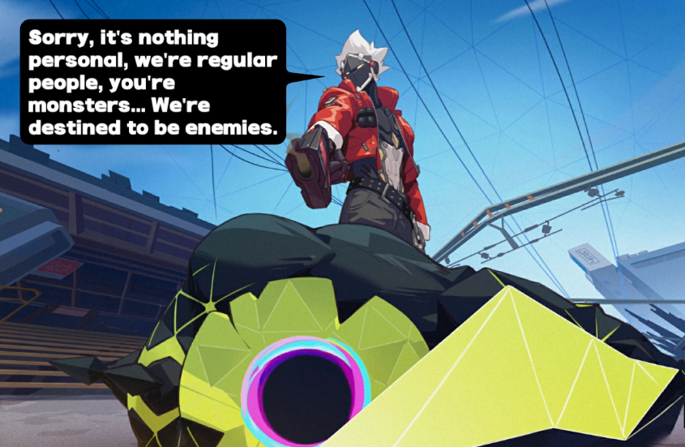

# Akash 

=== Welcome to Akash Documention ===  

## FAQ

- How much - 0.5 AKT or 5 USDC?
- Where is the stats?
- DDoS Protection

## How much - 0.5 AKT or 5 USDC?

You need at least 0.5 AKT or 5 USDC in your wallet to deploy on Akash. If you don't have 0.5 AKT or 5 USDC, you can switch to the sandbox

https://console.akash.network/settings

## Where is the stats?

https://stats.akash.network/

IP leases static IP:PORT https://akash.network/docs/network-features/ip-leases/#full-sdl-example-with-ip-leases

YAML https://akash.network/docs/getting-started/stack-definition-language/

Huge Akash API endpoint https://github.com/akash-network/akash-api/blob/main/docs/swagger-ui/swagger.yaml

akash-cli

akash-cli-booster https://akash.network/docs/deployments/akash-cli/cli-booster/

## DDoS Protection

https://www.pfsense.org/getting-started

## Create VM

